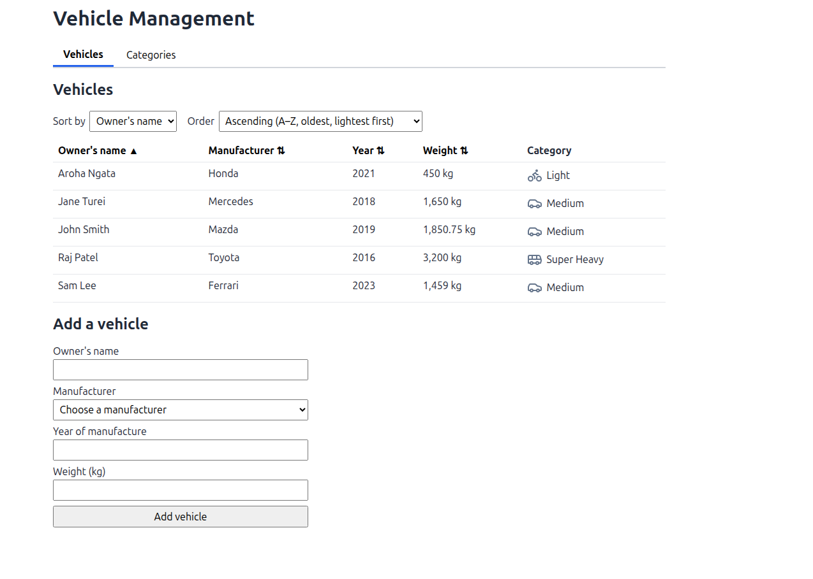
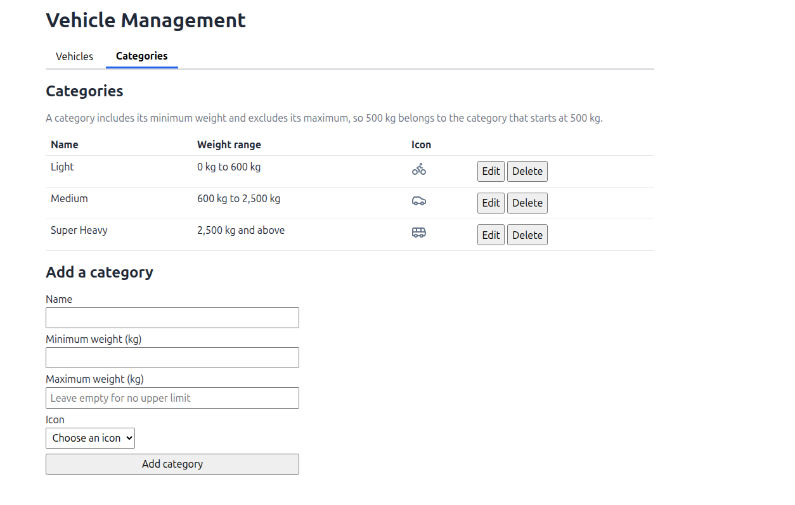

# Vehicle Management

A web application for managing vehicles and their weight categories: add and list vehicles, sort the list, and
manage the categories that each vehicle is placed in automatically by its weight.

- **Backend:** ASP.NET Core (.NET 10) REST API, Entity Framework Core, SQL Server. In `backend/`.
- **Frontend:** React + TypeScript (Vite). In `frontend/`.
- **API contract:** `docs/api-contract.md`, the only thing the two sides share.
- **AI assistant:** Claude Code (see [Use of AI](#use-of-ai)).
- **Built on:** Linux (Linux Mint 22.3), with SQL Server 2022 running in Docker, VS Code, .NET 10 and Node.js 24. The
  setup steps also cover Windows (LocalDB and the `dotnet ef` commands), but I developed and tested it on Linux.

## Quick start

You need the .NET 10 SDK, SQL Server 2019 or later, the EF Core tool (`dotnet tool install --global dotnet-ef`) and
Node.js 24 LTS. The full steps are in [Running the backend](#running-the-backend).

```bash
cd backend

# 1. Database connection: nothing to do with LocalDB on Windows. For any other SQL Server, set it once:
dotnet user-secrets set "ConnectionStrings:VehicleManagement" \
  "Server=localhost,1433;Database=VehicleManagement;User Id=sa;Password=<your-password>;TrustServerCertificate=True" \
  --project src/CreditWorks.VehicleManagement.Api

# 2. Create the VehicleManagement database, its tables and default data (no need to create it yourself)
scripts/migrations.sh update        # on Windows without Git Bash, see step 3 below

# 3. Run the API (http://localhost:5080)
dotnet run --project src/CreditWorks.VehicleManagement.Api --launch-profile http

# 4. In a second terminal, from the repository's root folder, run the React app (http://localhost:5173)
cd frontend
npm install
npm run dev

# 5. Run the tests (from backend/)
dotnet test
```

Then open **http://localhost:5173**. In VS Code, "Backend + frontend" in the Run and Debug panel does steps 3 and 4
for you (see [Running in VS Code](#running-in-vs-code)).

## Screenshots

**Vehicles tab:** the vehicle list with each vehicle's category and icon, sortable by any column (the sorted column
shows ▲ or ▼), and the form to add a vehicle.



**Categories tab:** the categories with their weight ranges and icons, editing and deleting, and the form to add a
category.



## Use of AI

I used **Claude**, an AI coding assistant, throughout this project to write code, tests and documentation from
my instructions. I directed the design and made the decisions, including:

- the modular monolith, with all HTTP code in the Api project and modules talking only through `Shared`;
- calculating a vehicle's category on every read instead of storing it;
- changing categories one at a time, with the neighbouring category moving so there's never a gap or an overlap;
- what happens on delete (the heavier neighbour takes over the range) and that the last category can't be deleted;
- keeping the frontend and backend independent, communicating only through REST;
- keeping the code simple, and focusing the tests on the two services with Moq.

I reviewed the code, tested the application by hand and with the automated tests, and asked for changes where the
code was more complex than the problem needed.

## Architecture

The backend is a **modular monolith**: one ASP.NET Core API, split by business area rather than by technical layer.

| Project | What it holds |
|---|---|
| `Api` | Everything HTTP: the endpoints (`Endpoints/`), the JSON request and response shapes (`Contracts/`), and error handling (`Errors/`) |
| `Modules/Categories` | Categories and icons: their tables, migrations, business rules and service |
| `Modules/Vehicles` | Vehicles and manufacturers: their tables, migrations, business rules and service |
| `Shared` | Only what the modules exchange (see below). No business logic |
| `tests/` | Unit tests for the business rules |

Inside each module, `Entities/` holds the database tables, `Data/` the `DbContext`, seed data and query helpers, and
`Services/` the business rules and the service the API calls.

**Why this structure**

- **It matches the separation the brief asks for.** The API project only handles HTTP; each module owns its business
  rules (`CategoryRules`, `VehicleRules`) and its data access (its own `DbContext`, tables and migrations).
- **The modules can't depend on each other.** Vehicles needs a vehicle's category, but it can't reference the
  Categories module: the compiler won't allow it. It asks through the `ICategoryResolver` interface in `Shared`
  instead. So the category rules live in one place and can't be bypassed or copied.
- **Everything about one business area is in one place.** Each module has its own schema in the database
  (`categories`, `vehicles`) and its own migrations.
- **It stays simple to run.** One API and one database, run as a single application. If a module ever had to become
  a separate service, its boundary is already clear.

**Trade-off:** for an application this small, a single project with folders would also work and would have fewer
files. I chose separate projects so the boundaries between the modules are enforced by the compiler rather than by
convention.

There's no separate repository layer: EF Core's `DbContext` and `DbSet` already act as the repository, so the services
query them directly.

### What the modules share

The `Shared` project holds only what the modules exchange:

| Type | Why it's shared |
|---|---|
| `ICategoryResolver` | How Vehicles asks Categories to check a weight and to find the category for each weight |
| `ValidationError` | One error shape for every module, so the API turns them into a 400 the same way |
| `WeightColumn` | The weight column format, `decimal(10, 2)`: vehicle weights and category boundaries must match |

The frontend and backend only share the REST API. The React app calls relative paths such as `/api/vehicles`, and in
development Vite forwards them to the backend, so the backend needs no knowledge of the frontend.

## Running the backend

All backend commands run from the `backend/` folder.

### 1. Install the required software

- **.NET 10 SDK**
- **SQL Server 2019 or later** (SQL Server Express, LocalDB or Docker are all fine)
- **The EF Core command-line tool**, used to create the database:
  ```bash
  dotnet tool install --global dotnet-ef
  ```
- **Node.js 24 LTS** (with npm), only for the frontend

### 2. Configure the database connection

The API reads one setting, the connection string named `VehicleManagement`. No password is committed to the
repository.

The database itself is called **`VehicleManagement`** (the `Database=VehicleManagement` part of the connection
string). **You don't need to create it**: step 3 creates it, with its tables and default data. To use a different
name, change `Database=` in your connection string before step 3.

**Windows with LocalDB** (installed with Visual Studio): nothing to configure. The default in
`src/CreditWorks.VehicleManagement.Api/appsettings.Development.json` points at `(localdb)\MSSQLLocalDB` with Windows
authentication.

**Any other SQL Server** (a full or Express instance, or Docker on Linux/macOS): store your connection string in .NET
User Secrets, which are kept outside the repository:

```bash
# Optional: run SQL Server in Docker. Choose your own strong password.
docker run -d --name vehicle-sql -p 1433:1433 \
  -e ACCEPT_EULA=Y -e MSSQL_PID=Express -e 'MSSQL_SA_PASSWORD=<your-password>' \
  mcr.microsoft.com/mssql/server:2022-latest

cd src/CreditWorks.VehicleManagement.Api
dotnet user-secrets set "ConnectionStrings:VehicleManagement" \
  "Server=localhost,1433;Database=VehicleManagement;User Id=sa;Password=<your-password>;TrustServerCertificate=True"
cd ../..
```

You can also set the environment variable `ConnectionStrings__VehicleManagement` instead. If the connection string
is missing, the API stops at startup with a message saying so.

### 3. Create the database

This creates the `VehicleManagement` database (if it doesn't exist yet) and its tables, and adds the default data:

| Data | Default values |
|---|---|
| Manufacturers | Mazda, Mercedes, Honda, Ferrari, Toyota |
| Categories | Light (0 to 500 kg, motorcycle icon), Medium (500 to 2500 kg, car icon), Heavy (2500 kg and above, truck icon) |
| Icons | bicycle, motorcycle, car, van, truck, bus, tractor |
| Vehicles | None: the list starts empty, and vehicles are added through the app |

The default data is added once, when the database is created. After that, categories can be changed in the app,
and running the migrations again doesn't reset them.

**Linux, macOS or Git Bash on Windows:**
```bash
scripts/migrations.sh update
```

**Windows (Command Prompt or PowerShell):** run the same two steps directly:
```bash
dotnet ef database update --project src/Modules/CreditWorks.VehicleManagement.Modules.Categories --startup-project src/CreditWorks.VehicleManagement.Api --context CategoriesDbContext
dotnet ef database update --project src/Modules/CreditWorks.VehicleManagement.Modules.Vehicles --startup-project src/CreditWorks.VehicleManagement.Api --context VehiclesDbContext
```

Running it again is safe: EF only applies migrations that haven't run yet.

### 4. Build and run the API

```bash
dotnet build
dotnet run --project src/CreditWorks.VehicleManagement.Api --launch-profile http
```

The API listens on **http://localhost:5080**. To check it's working:
```bash
curl http://localhost:5080/api/categories/all
```

To have code changes apply without restarting (hot reload), run it with `dotnet watch` instead:
```bash
dotnet watch --project src/CreditWorks.VehicleManagement.Api --launch-profile http
```

In VS Code, you can also start it from the Run and Debug panel (see [Running in VS Code](#running-in-vs-code)).

The endpoints and their JSON are listed in `docs/api-contract.md`.

### 5. Run the tests

```bash
dotnet test                                                     # all tests
dotnet test --filter "FullyQualifiedName~CategoryServiceTests"  # one test file
```

No SQL Server is needed to run them. See [Testing](#testing) for what they cover.

### Changing the database later

After changing a module's entities, add a migration and apply it (`<module>` is `categories` or `vehicles`):

```bash
scripts/migrations.sh add <module> <MigrationName>   # create a migration
scripts/migrations.sh update <module>                # apply it
scripts/migrations.sh list <module>                  # see which migrations have been applied
scripts/migrations.sh remove <module>                # delete the last migration, if it hasn't been applied
```

The script fills in the `--project`, `--startup-project` and `--context` options of `dotnet ef` for each module.

## Running the frontend

With the backend running:

```bash
cd frontend
npm install
npm run dev
```

Open **http://localhost:5173**. See `frontend/README.md` for the frontend's structure.

## Running in VS Code

Open the repository's root folder (`VehicleManagement`) in VS Code, with the **C# Dev Kit** extension installed. The
**Run and Debug** panel (Ctrl+Shift+D) lists these options, defined in `.vscode/launch.json`. Pick one and press
**F5**:

| Option | What it does |
|---|---|
| **Backend + frontend** | Starts the API with hot reload and the React app together; stopping one stops both. The easiest way to run everything |
| **Debug API** | Starts the API with the debugger attached, so breakpoints work. Restart it after code changes |
| **Hot reload API** | Starts the API with `dotnet watch`: saved changes apply to the running API. Breakpoints don't work |
| **Run API** | Starts the API with `dotnet run`, without debugging or hot reload |
| **Run frontend** | Starts the React app on http://localhost:5173 (the API must be running too) |

Every option builds the code first, and the API uses port 5080 (from `launchSettings.json`). The database connection
and migrations are still needed first (steps 2 and 3 above).

## API

The backend is a REST API on `http://localhost:5080`. The full request and response JSON, and the error format, are in
[`docs/api-contract.md`](docs/api-contract.md).

| Method | Path | What it does |
|---|---|---|
| `GET` | `/api/vehicles?sortBy={field}&sortDirection={asc\|desc}` | All vehicles, sorted by `ownerName`, `manufacturer`, `yearOfManufacture` or `weightKg`, each with its current category |
| `POST` | `/api/vehicles` | Adds a vehicle |
| `GET` | `/api/manufacturers` | The manufacturers a vehicle can have |
| `GET` | `/api/categories/all` | All categories, lightest first |
| `GET` | `/api/categories/findByWeight?weightKg={weight}` | The category a weight belongs to |
| `POST` | `/api/categories` | Adds a category; the category it's carved out of is shortened |
| `PUT` | `/api/categories/{id}` | Changes a category's name, icon and range; the neighbours move with it |
| `DELETE` | `/api/categories/{id}` | Deletes a category; a neighbour takes over its range |
| `GET` | `/api/icons` | The icons a category can be given, with their images |

Every error is returned as RFC 7807 problem details. A validation error is a `400` with a message per field, for
example `{"errors": {"WeightKg": ["Weight must be greater than 0."]}}`; rules about several categories together, such
as a gap, are under `Categories`. A missing record is a `404`, and an unexpected error is a `500` with no technical
details.

## Testing

The tests (xUnit) cover the two services, `CategoryService` and `VehicleService`, because that's where every business
rule is applied and saved. They check category determination, boundary values (500.00 kg is Medium), gaps and
overlaps, category changes applying to existing vehicles, vehicle validation and sorting. Every rejected change is
also checked to save nothing.

They need no SQL Server: they use EF Core's in-memory database. `VehicleService` asks the Categories module whether a
weight is valid and which category it belongs to, so `VehicleServiceTests` give it a **Moq** mock that answers instead.
That way they test only the vehicle behaviour, and can control the answers (for example, "this weight is now Heavy").
There are no integration tests or frontend tests.

## Vehicle rules

A vehicle needs an owner's name (at most 100 characters), a manufacturer from the seeded list, a year of
manufacture from 1886 (the first petrol car) to next year (next year's models go on sale this year), and a weight
above 0 with at most 2 decimal places. The weight rules belong to the Categories module, because a vehicle weight
must fit a category; the Vehicles module asks for them through `ICategoryResolver` rather than copying them.

The vehicle list can be sorted by owner's name, manufacturer, year or weight, ascending or descending. A vehicle's
category is **worked out from its weight every time the list is read**, with one query for all the weights, and is
never stored. So a change to the categories shows on existing vehicles straight away: add a category from 3000 kg
and a 3500 kg vehicle moves into it; delete it and the vehicle is back in the category below.

The Vehicles module mirrors the Categories module: `VehicleRules` holds every vehicle rule and `VehicleService` reads
and saves. Sorting is part of the database query, so it lives in `Data/VehicleQueryExtensions.cs` as an extension
method (`db.Vehicles.SortBy(...)`) that EF turns into SQL `ORDER BY`. Both are tested through
`VehicleServiceTests`.

## Category rules

### Boundary rule

A category's range **includes its minimum and excludes its maximum** (`min ≤ weight < max`). A weight exactly on a
boundary belongs to the heavier category, so with the default categories:

| Weight | Category |
|---|---|
| 499.99 kg | Light (0–500) |
| 500.00 kg | Medium (500–2500) |
| 2500.00 kg | Heavy (2500 and above) |

The heaviest category has no maximum (`maxWeightKg: null`).

### Rules the configuration must always meet

Sorted by minimum weight, the categories must start at 0 kg, each maximum must equal the next category's minimum
(no gaps, no overlaps), and only the heaviest may have no maximum. Every valid weight then belongs to exactly one
category. Names are required and unique (ignoring case), each category needs an icon from the fixed set, and
weights allow at most 2 decimal places.

A vehicle's category is **calculated from its weight when it's read, never stored**, so a change to the categories
applies to existing vehicles immediately.

### Changing categories

| Change | Endpoint | What happens to other categories |
|---|---|---|
| Add | `POST /api/categories` | The category the new one is carved out of is shortened |
| Edit | `PUT /api/categories/{id}` | If the range changes, the neighbours move with it |
| Delete | `DELETE /api/categories/{id}` | A neighbour takes over the deleted range |

**Adding.** The new range must fit inside one existing category and start or end where that category does, and
that category is shortened to make room. For example, with Heavy at 2500 and above, adding "Super heavy" from
3000 kg makes Heavy 2500–3000. A new category is rejected if its name is already used, if it overlaps two
categories (2000–3000), if it sits in the middle of one (3000–3500 inside Heavy would leave 3500 and above with
no category), or if it covers a category's whole range.

**Editing.** The name, icon and range can all change. Moving a boundary moves the neighbour's too, so the ranges
keep touching: changing Medium's maximum from 3000 to 2500 makes the next category start at 2500. A change that
would leave a neighbour with no weights, or move the lightest category away from 0 kg, is rejected.

**Deleting.** The **heavier neighbour takes over the deleted range**:

```
Before:          Light 0–500 | Medium 500–2500 | Heavy 2500+
Delete Medium:   Light 0–500 | Heavy 500+
Delete Light:    Medium 0–2500 | Heavy 2500+
Delete Heavy:    Light 0–500 | Medium 500+        (the heaviest has no heavier neighbour, so the lighter one takes over)
```

Simply removing the category is not an option: deleting Medium without changing a neighbour would leave every
vehicle from 500 to 2500 kg without a category, which the brief forbids. The heavier neighbour is the default,
and the response returns the full, saved list, so the client sees straight away which category changed.

**The last category can't be deleted.** At least one category must exist, otherwise no weight would have a
category and there would be nothing left to take over a range. `DELETE` on the only remaining category returns
`400` ("The last category can't be deleted: every weight needs a category.").

### Icons

Users **choose** a category's icon from a fixed set; `GET /api/icons` lists them with their images. Icons are
reference data seeded by migration (`Data/CategoryIconSeed.cs`), like manufacturers, so adding, changing or
removing one means editing the seed and adding a migration. Users can't upload their own icons on purpose: an
SVG file can contain scripts, so accepting uploads would open a cross-site-scripting risk, and the brief only
asks for icons to be assigned ("You may choose any suitable icons").

### How the rules are enforced

The Categories module's logic is three classes:

| Class | Job |
|---|---|
| `CategoryRules` | Every rule, in one place: weight format, the boundary rule, required fields, gaps and overlaps |
| `CategoryEditor` | What adding, editing or deleting a category does to its neighbours |
| `CategoryService` | Runs every change in the same three steps, below |

Every add, edit or delete takes the same three steps in `CategoryService`:

1. **Make the change.** Load all categories and apply the change; `CategoryEditor` adjusts the neighbours.
2. **Check every rule** on the result with `CategoryRules.CheckAll`.
3. **Save** with one `SaveChangesAsync`. EF saves all the changes together (the new or deleted category and the
   neighbour that moved), or none of them.

Nothing is saved if a rule is broken; the response is `400` with a message per field. `CategoryRules` and
`CategoryEditor` are tested through `CategoryServiceTests`, which checks each change is saved correctly, or not
at all.

**Known limitation:** if two people change the categories at the exact same moment, each change is checked on its
own, so together they could leave a gap or an overlap. For a small admin screen this is very unlikely. A production
system would prevent it by locking the categories while a change is saved (for example, with a serializable
transaction).

The database checks the rules that hold for each row on its own (name not blank, weights not negative, maximum
above minimum). The rules that compare rows (no gaps, no overlaps, unique names) are in code: a SQL Server check
constraint can only look at one row, and constraints are checked after every statement rather than at the end of
the transaction, so they would reject a valid delete that moves a neighbour's boundary. Doing this in the database
would need triggers, which are harder to read and test than `CategoryRules`.

## Database design

SQL Server, created by EF Core migrations. Each module has its own schema and its own migrations, in one database.

| Table | Columns | Notes |
|---|---|---|
| `vehicles.Vehicles` | `Id`, `OwnerName` (up to 100), `ManufacturerId`, `YearOfManufacture`, `WeightKg` `decimal(10,2)` | **No category column**: the category is calculated from the weight when read |
| `vehicles.Manufacturers` | `Id`, `Name` (up to 50, unique) | Seeded with Mazda, Mercedes, Honda, Ferrari and Toyota |
| `categories.Categories` | `Id`, `Name` (up to 50), `MinWeightKg`, `MaxWeightKg` (null means no upper limit), `IconId` | Seeded with Light, Medium and Heavy |
| `categories.CategoryIcon` | `Id`, `Key` (such as `car`, unique), `Svg` | Seeded with seven icons |

- **Foreign keys** link a vehicle to its manufacturer and a category to its icon. Both are restricted: a manufacturer
  or icon can't be deleted while something uses it.
- **Check constraints** enforce the rules that hold for each row on its own: names not blank, weight above 0, year
  from 1886, minimum weight not negative, maximum above minimum.
- The rules that compare category rows (no gaps, no overlaps, unique names) are enforced in code, because a check
  constraint can only look at one row (see "How the rules are enforced").
- **Manufacturers are a table, not an enum**, so a new manufacturer is a data change (a seed entry and a migration),
  not a code change.
- There's **no database link between vehicles and categories**: the modules are separate, and the category is never
  stored.

## Assumptions

- A category includes its minimum weight and excludes its maximum, so 500.00 kg is Medium.
- Weights are in kilograms, above 0, with at most 2 decimal places, up to 99,999,999.99 kg (what a `decimal(10,2)`
  column holds).
- The year of manufacture runs from 1886 (the first petrol car) to next year (next year's models go on sale this year).
- The owner's name is required, up to 100 characters.
- Manufacturers and icons are fixed reference data: seeded by migration and read-only in the app. Users choose an
  icon; they can't upload one.
- Deleting a category gives its range to the heavier neighbour, or to the lighter one when the heaviest is deleted.
- Vehicles can be added, listed and sorted, as the brief asks; editing and deleting vehicles is not included.
- There's no sign-in: the brief makes authentication optional, so every endpoint is open.
- There are only a handful of categories, so they're loaded together and matched in memory.

## Significant design decisions

| Decision | Why |
|---|---|
| A vehicle's category is **calculated from its weight on every read**, never stored | It can never be out of date: changing a category applies to existing vehicles immediately, with nothing to update |
| Category changes are **checked as a whole set before saving** | Gaps and overlaps are about how categories fit together, so every add, edit or delete is checked on the complete result, and nothing is saved if a rule fails |
| Changing one category **moves its neighbour** | The ranges always keep touching, so users can make one change at a time without creating a gap |
| Cross-row rules in **code**, not database constraints | SQL Server check constraints only see one row, and are checked after every statement, which would reject valid changes |
| **Modular monolith** with a `Shared` interface | The compiler keeps Vehicles and Categories apart, so the category rules live in one place; it's still one app to run |
| No separate repository layer | EF Core's `DbContext` already acts as the repository |
| The frontend talks to the backend only through REST, using Vite's development proxy | The backend needs no knowledge of the frontend (no CORS settings) |
| Icons stored in the database as SVG, shown through `` | Icons are data like manufacturers; an `` can't run scripts inside an SVG |

## Known limitations

- **Simultaneous category changes:** if two people change the categories at the exact same moment, each change is
  checked on its own, so together they could leave a gap or an overlap. Very unlikely on a small admin screen.
- **No paging:** the vehicle list returns every vehicle at once.
- **No authentication:** anyone who can reach the API can change the categories.
- **No integration tests** against a real SQL Server, and no frontend tests.
- **No editing or deleting of vehicles.**
- `scripts/migrations.sh` is a bash script; on Windows, use the `dotnet ef` commands shown in "Create the database".

## What I'd improve for production

1. **Integration tests** that run the real API against a real SQL Server database.
2. **Protect category changes from running at the same time**, for example by saving them in a serializable
   transaction.
3. **Page the vehicle list** and add database **indexes** on the sortable columns, so it stays fast with a lot of data.
4. **Cache the categories** in memory, since they rarely change, and refresh the cache when one changes.
5. **Authentication**, with category changes limited to administrators.
6. **Edit and delete vehicles.**
7. **Instant validation in the frontend** (the server stays the authority), and a more polished UI.
8. **Easier setup:** apply migrations automatically in development, or provide Docker Compose with SQL Server.
9. A **CI pipeline** that builds and runs the tests on every push.
